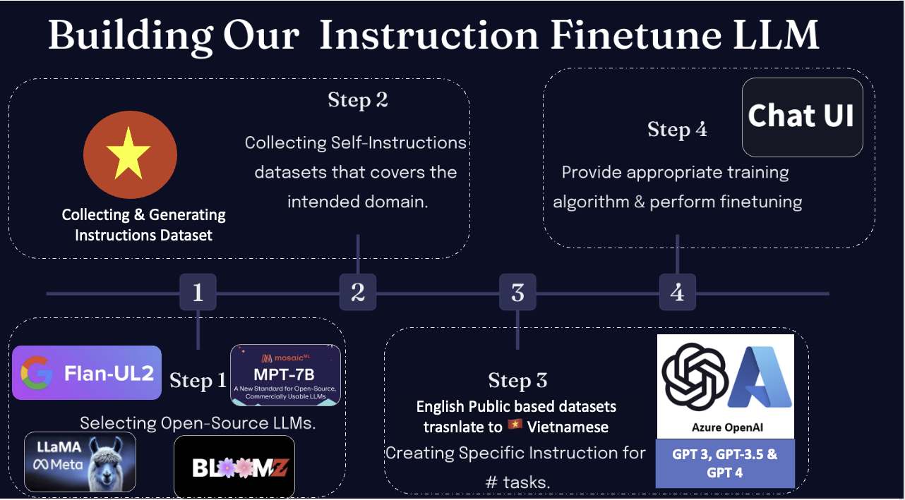

<h1 align="center">
   🇻🇳 Cộng đồng LLMs Việt Nam - Vietnamese Language Models Community
</h1>

     

## 💡 Get help - [Q&A](https://github.com/TranNhiem/Vietnamese_LLMs/discussions) or [Discord 💬](https://discord.gg/eH7eg4fT)

# Nội Dung (Table of Contents)

- [Giới thiệu về Vietnamese_LLMs](#Giới-thiệu-dự-án)
- [Mục tiêu dự án](#các-liên-kết-hữu-ích)
- [Cách tiến hành dự án](#cách-thử-nghiệm-open-assistant)
- [Tầm nhìn](#tầm-nhìn)
- [Kế Hoạch](#kế-hoạch)
- [Làm thế nào bạn có thể giúp đỡ](#làm-thế-nào-bạn-có-thể-giúp-đỡ)

## Giới thiệu dự án (Project Introduction):

Chào bạn đến với dự án Cộng đồng LLMs Việt Nam! Dự án với mục tiêu tạo ra bộ dữ liệu Vietnamese instruction và  thực hiện Supervised instruction fine-tuning trên các Open-source mô hình ngôn ngữ  Bloom, OpenLLaMA, GPT-J pythia và nhiều mô hình khác.

## Mục tiêu dự án (Project Goal):

- Xây dựng Bộ dữ liệu Hướng dẫn tiếng Việt chất lượng cao
- Huấn luyện, Tinh chỉnh và Đánh giá Mô hình Ngôn ngữ tiếng Việt (Training, Finetuning, Evaluation)
- Thiết kế Ứng dụng với Giao diện Người dùng tối ưu hiệu suất

## Các nhiệm vụ (Tasks):

1. Xây dựng Bộ dữ liệu tiếng Việt Instructions Vietnamese (chất lượng, nhiều, và đa dạng):
   - Dịch các bộ dữ liệu tiếng Anh
   - Tổng hợp nguồn dữ liệu đa dạng
   + Bộ dữ liệu về Báo Chí 
   + 
   - Tạo dữ liệu tự học bổ sung

   + Reference Consider Project Dataset and Design How to deploy this to this Project
   
   - Tạo Bộ dữ liệu dựa trên các mô hình ngôn ngữ lớn (GPT3, GPT-3.5, GPT-4, PALM2 etc)

2. Huấn luyện và Đánh giá Mô hình Ngôn ngữ (Training, Finetuning, Evaluating, Testing LLM):
   - Finetuning (Tinh chỉnh) các Open-source LLMs mô hình ngôn ngữ : bloomz, OpenLLaMA, GPT-J pythia etc. trên Vietnamese Instruction Dataset
   - Đánh giá hiệu suất

3. Thiết kế Ứng dụng 
   - Giao diện Người dùng (UI)
   - Tối ưu hiệu suất ứng dụng

## Tầm Nhìn (Project Vision)
[Vision & Roadmap](https://docs.google.com/presentation/d/1qfIQoGMmarlZWzRa5lVQrMD67SmoVb7F6jr5NS0_Hx0/edit?usp=sharing)

+ Slide 
+ 
We are not going to stop at replicating ChatGPT. We want to build the assistant
of the future, able to not only write email and cover letters, but do meaningful
work, use APIs, dynamically research information, and much more, with the
ability to be personalized and extended by anyone. And we want to do this in a
way that is open and accessible, which means we must not only build a great
assistant, but also make it small and efficient enough to run on consumer
hardware.

+ RLHF
+ AgentLLM
+ Application LLMs on (Education, Medical, Finance, Industries)

## Kế Hoạch (Project plan)

[Cấu trúc của dự án] (https://docs.google.com/presentation/d/1OdCTI1vMpftOMTOXXHEt2Ck5SBLSkPf_Zwedq7n3wec/edit?usp=sharing)

1. Collect high-quality human generated Instruction-Fulfillment samples
   (prompt + response), goal >50k. We design a crowdsourced process to collect
   and reviewed prompts. We do not want to train on
   flooding/toxic/spam/junk/personal information data. We will have a
   leaderboard to motivate the community that shows progress and the most active
   users. Swag will be given to the top-contributors.
2. For each of the collected prompts we will sample multiple completions.
   Completions of one prompt will then be shown randomly to users to rank them
   from best to worst. Again this should happen crowd-sourced, e.g. we need to
   deal with unreliable potentially malicious users. At least multiple votes by
   independent users have to be collected to measure the overall agreement. The
   gathered ranking-data will be used to train a reward model.
3. Now follows the RLHF training phase based on the prompts and the reward
   model.

We can then take the resulting model and continue with completion sampling step
2 for a next iteration.

## Làm Thế Nào Bạn Có Giúp Đở (How You can HELP)

we collaborate we can together gift our knowledge and technology to the world for the benefit of humanity.
1. how to Build Project Together
Check out our  [contributing guide](contribute.md) to get started. 

2. We still Need more Computing Resources
  + Please help us sponser Traning Compute 
  + Please help us to connect private sectors in public to bring this project at scale.

