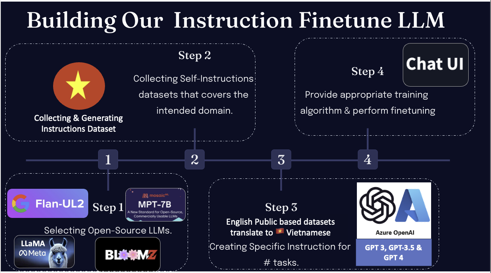

<h1 align="center">
   🇻🇳 Cộng đồng LLMs Việt Nam - Vietnamese Language Models Community
</h1>

     

## 💡 Get help - [Q&A](https://github.com/TranNhiem/Vietnamese_LLMs/discussions) or [Discord 💬](https://discord.gg/eH7eg4fT)

# Nội Dung (Table of Contents)

- [Giới thiệu về Vietnamese_LLMs](#Giới-thiệu-dự-án)
- [Mục tiêu dự án](#các-liên-kết-hữu-ích)
- [Cách tiến hành dự án](#cách-thử-nghiệm-open-assistant)
- [Cấu trúc của dự án](#Cấu-trúc-của-dự-án)
- [Tầm nhìn](#tầm-nhìn)
- [Kế Hoạch](#kế-hoạch)
- [Làm thế nào bạn có thể giúp đỡ](#làm-thế-nào-bạn-có-thể-giúp-đỡ)

## Giới thiệu dự án (Project Introduction):

Chào bạn đến với dự án Cộng đồng LLMs Việt Nam! Dự án với mục tiêu tạo ra bộ dữ liệu Vietnamese instruction và  thực hiện Supervised instruction fine-tuning trên các Open-source mô hình ngôn ngữ  Bloom, OpenLLaMA, GPT-J, MPT, Pythia và nhiều mô hình khác.

+ [Dự án Tổng Quan] ()

## Mục tiêu dự án (Project Goal):

- Xây dựng Bộ dữ liệu Hướng dẫn tiếng Việt chất lượng cao
- Huấn luyện, Tinh chỉnh và Đánh giá Mô hình Ngôn ngữ tiếng Việt (Training, Finetuning, Evaluation)
- Thiết kế Ứng dụng với Giao diện Người dùng tối ưu hiệu suất

## Các nhiệm vụ (Tasks):

1. Xây dựng Bộ dữ liệu Tiếng Việt cho Hướng dẫn (Instructions) (chất lượng, phong phú và đa dạng):
   - Chuyển đổi các bộ dữ liệu Hướng dẫn Tiếng Anh sang Tiếng Việt.
   - Tổng hợp các nguồn dữ liệu đa dạng có sẵn:
     + Sử dụng bộ dữ liệu Hướng dẫn Tiếng Việt từ wikiHow, ví dụ: [human-instruction Vietnamese dataset](https://www.kaggle.com/datasets/paolop/human-instructions-vietnamese-wikihow?resource=download).
     + Sử dụng các bộ dữ liệu từ lĩnh vực Báo chí, Y học, Giáo dục, v.v., ví dụ: bộ dữ liệu từ Báo Corpus ([news-corpus](https://github.com/binhvq/news-corpus)).
   - Tạo bổ sung bộ dữ liệu tự học (self-instruct):
     + Sử dụng bộ dữ liệu tự học như Stanford Alpaca.
     + Tạo bộ dữ liệu dựa trên các mô hình ngôn ngữ lớn như GPT-3, GPT-3.5, GPT-4, PALM2, v.v.

2. Huấn luyện và Đánh giá Mô hình Ngôn ngữ (Training, Finetuning, Evaluating, Testing LLM):
   - Tinh chỉnh (Finetuning) các mô hình ngôn ngữ mã nguồn mở như bloomz, OpenLLaMA, GPT-J pythia, v.v. trên Bộ dữ liệu Hướng dẫn Tiếng Việt.
     + Áp dụng các kỹ thuật tối ưu hóa (Compression Machine learning) như [Quantization](https://github.com/IST-DASLab/gptq), [Sparsity & Quantization](https://github.com/Vahe1994/SpQR).
     + Sử dụng kỹ thuật tinh chỉnh hiệu quả như [LoRA]() và [QLoRA](https://huggingface.co/blog/4bit-transformers-bitsandbytes).
     + Áp dụng các kỹ thuật tối ưu hóa Huấn luyện và Tinh chỉnh như [Deepspeed](https://www.microsoft.com/en-us/research/blog/zero-deepspeed-new-system-optimizations-enable-training-models-with-over-100-billion-parameters/), [Colossal AI](https://colossalai.org/).
  - Bạn có thể theo dõi chi tiết model Finetuning [kết quả](https://wandb.ai/tranrick/Vietnamese_LLMs/reports/Vietnamese_LLMs---Vmlldzo0NjM4Nzg3)
  - Đánh giá hiệu suất của mô hình trên các bài kiểm tra (Benchmark) và các tình huống thực tế.
   - Kiểm thử mô hình trên nhiều cách sử dụng khác nhau.

3. Thiết kế Ứng dụng:
   - Thiết kế Giao diện Người dùng (UI) thân thiện và dễ sử dụng.
   - Tối ưu hiệu suất ứng dụng.

## Cấu Trúc Của Dự Án (Project Structure)

Dưới đây là cấu trúc của dự án, mô tả các phần quan trọng và chức năng chính của chúng:

### 1. Tạo và Dịch Các Bộ Dữ liệu (Generate and Translate Dataset)

Thư mục `/Generate_and_Translate_Dataset` chứa các bộ dữ liệu và công cụ liên quan đến việc tạo và dịch các instruction dataset.

- Phần Dịch (Translation Dataset)

  - `Using_OpenAI_Translate_API.py`: Sử dụng OpenAI GPT-3.5 và GPT-4 để dịch các bộ dữ liệu. Đây là một phương pháp cho kết quả tốt.

  - `Using_NLLB_MetaAI_Translate.py`: Sử dụng NLLB làm mô hình cho việc dịch. Bạn có thể sử dụng 54B model để đạt được kết quả tương đối.

- Phần Tạo Instruction Dataset

  - `Generation_instruction_OpenAI_api.py`: Sử dụng Stanford Alpaca template để tạo các instruction dataset. Gồm hơn 175 instruction tasks được tạo bởi con người.

  - Cập Nhập Sớm trong Tương Lai: Phần này dự kiến sẽ được cập nhật với thông tin về cách tạo thêm Instruction dataset từ các nguồn khác.

### 2. Training & Fine-tune LLM Model

Thư mục `/LLMs` chứa các tệp tin và công cụ để training và fine-tune các mô hình ngôn ngữ (Language Models).

- Phần Fine-tuning dựa trên các Open-Source Based LLMs (BLOOMZ, Open-LLaMA, v.v.)

  - `Finetune_llm_LoRA.py`: Cung cấp công cụ để fine-tune các mô hình LLMs dựa trên các mã nguồn mở như BLOOMZ, Open-LLaMA, v.v.

  - `Finetune_llm_QLoRA.py`: Đây là một công cụ khác để fine-tune các mô hình LLMs dựa trên các mã nguồn mở.

### 3. Giao Diện Web (Web UI Interface)

Thư mục `/WebUI` chứa các tệp tin và công cụ liên quan đến giao diện người dùng qua Web.

- Hiện tại, để nhanh chóng và thuận tiện cho việc demo và kiểm thử, chúng tôi sử dụng Gradio để phát triển giao diện.

  - `assistant_gradio.py`: Đây là ứng dụng đã được phát triển dựa trên Gradio, cho phép trải nghiệm trực quan và trò chuyện với trợ lý thông qua giao diện Web.

Hy vọng Với cấu trúc này, dự án có thể được quản lý một cách cụ thể và dễ đàng để cập nhập [mọi người có thể góp ý để có một cấu trúc tốt hơn]()

## Tầm Nhìn (Project Vision)

[Chi Tiết về Vision & Roadmap](https://docs.google.com/presentation/d/1qfIQoGMmarlZWzRa5lVQrMD67SmoVb7F6jr5NS0_Hx0/edit?usp=sharing)

Xây dựng trợ lý thông minh tiếng Việt của tương lai, vượt trội và linh hoạt hơn bao giờ hết!

+ Chúng ta sẽ tạo ra một mô hình LLMs (Language Models) tiên tiến có khả năng xử lý tốt các tác vụ tiếng Việt. Mục tiêu của phát triển mạnh các LLMs  ứng dụng khác trong Giáo dục, Y tế, Tài chính và Công nghiệp.

+ Điều đặc biệt là chúng ta muốn tạo ra mô hình trợ lý có khả năng tương tác nâng cao trên tiếng Việt. Hơn thế nữa chúng ta cũng đặt mục tiêu làm cho mô hình này nhỏ gọn và hiệu quả, để có thể chạy trên các người dùng cá nhân máy tính với các GPUs thế hệ thấp với ít memory.

+ Dự án này chúng ta mong muốn nhận được sự đóng góp và hỗ trợ cộng đồng. Hãy cùng nhau xây dựng một trợ lý thông minh nói riêng và mô hình ngôn ngữa thuần tiếng Việt nói chung và góp phần tạo ra những đóng góp ý nghĩa cho cộng đồng Việt Nam 🇻🇳.

## Kế Hoạch (Project plan)

<!--  [Cấu trúc của dự án](https://docs.google.com/presentation/d/1OdCTI1vMpftOMTOXXHEt2Ck5SBLSkPf_Zwedq7n3wec/edit?usp=sharing) -->

### Bước 1: Dịch tập dữ liệu hướng dẫn
- Mục tiêu: Dịch các bộ dữ liệu chuẩn và chất Lượng English based instructions dataset : [Alpaca](https://github.com/tatsu-lab/stanford_alpaca/blob/main/alpaca_data.json), [Dolly 15k](https://huggingface.co/datasets/databricks/databricks-dolly-15k), [OpenAssistant](https://huggingface.co/datasets/OpenAssistant/oasst1), [Filtered_ShareGPT](https://huggingface.co/datasets/anon8231489123/ShareGPT_Vicuna_unfiltered) others dataset.
- Xây dựng hệ thống, thống kê hiển thị các chủ đề khác nhau trong tập dữ liệu đã thu thập. Mục đích là loại bỏ dữ liệu chứa thông tin gây lặn, độc hại, spam, rác rưởi hoặc thông tin cá nhân hoặc các dữ không đạt yêu cầu.

### Bước 2: Tạo tập dữ liệu hướng dẫn tự động
- Sử dụng OpenAI GPT-3.5, GPT-4 để tạo tập dữ liệu hướng dẫn.
- Mục tiêu: Thu thập 500.000 đến 1 triệu mẫu hướng dẫn đầu vào + phản hồi (Instructions, outputs)
- Đồng thời, chúng tôi thu thập các hướng dẫn được tạo bởi con người có sẵn bằng tiếng Việt.

### Bước 3: Kiểm định và tiền xử lý tập dữ liệu
- Kết hợp tập dữ liệu từ Bước 1 và Bước 2.
- Tiền xử lý tập dữ liệu để chuẩn bị cho các bước tiếp theo.

### Bước 4: Tiến hành giai đoạn SFT (Supervised instruction Finetuning)
- Dựa trên tập dữ liệu hướng dẫn tiếng Việt, tiến hành giai đoạn SFT để tinh chỉnh mô hình.

### Bước 5: Tiếp tục huấn luyện mô hình với giai đoạn RLHF (Reinforcement Learning from Human Feedback)
- Sau khi hoàn thành Bước 4, chúng ta có thể tiếp tục huấn luyện mô hình với giai đoạn RLHF dựa trên tập dữ liệu hướng dẫn từ con người thuộc dự án OpenAssistant công khai.

Hãy nhớ rằng các bước này đại diện cho quy trình chung và có thể được điều chỉnh và bổ sung theo yêu cầu cụ thể của dự án.

## Làm Thế Nào Bạn Có Giúp Đỡ (How You can HELP)

Chúng ta có thể cùng nhau đóng góp tri thức và công nghệ của mình để mang lại lợi ích cho cộng đồng Việt Nam.

1. bạn có thể cùng xây dựng dự án: 
Hãy xem hướng dẫn [Đóng Góp Cho Dự Án](contribute.md) để bắt đầu chung tay xây dựng dự án này.

2. Bạn có thể hổ trợ về tài nguyên như máy chủ server hoặc các tài nguyên khác.
  - Dự án hiện rất cần các nguồn tài trợ tài nguyên GPUs để có thể tiến hành quá trình huấn luyện (Pretraining) và quá trình tinh chỉnh (Finetuning).
  - Nếu bạn Có thể giúp dự án kết nối với các công ty tư nhân để mang dự án này áp dụng rộng rãi.
  - Bạn có thể kết nối trực tiếp với Trần Nhiệm [LinkedIn](https://www.linkedin.com/in/tran-nhiem-ab1851125/) [Facebook](https://www.facebook.com/jean.tran.336). Nhiệm với  vụ cho Lập kế hoạch và Lên lịch, Tài liệu và Báo cáo.
